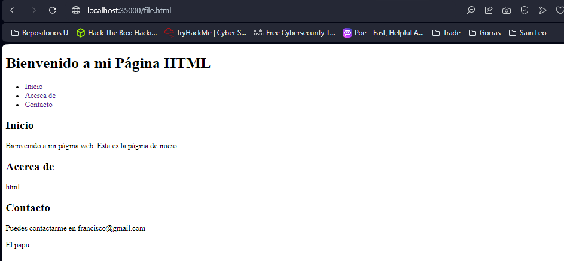

# TALLER 2: TALLER DISEÑO Y ESTRUCTURACIÓN DE APLICACIONES DISTRIBUIDAS EN INTERNET


Programa creado para que el usuario pueda visualizar y usar los archivos locales del servidor.


### Prerequisitos

Para elaborar este proyecto se requirio de : 


Maven: Apache Maven es una herramienta que maneja el ciclo de vida del programa.


Git: Es un sistema de control de versiones distribuido (VCS).


Java 19: Java es un lenguaje de programación de propósito general orientado a objetos, portátil y muy versátil.


### Instalación

Clonamos el repositorio

```
    git clone https://github.com/franciscoMarquezBocanegra/TALLER-DISE-O-Y-ESTRUCTURACI-N-DE-APLICACIONES-DISTRIBUIDAS-EN-INTERNET

```
Se accede a la carpeta principal del repositorio repositorio que acabamos de clonar

	 cd TALLER-DISE-O-Y-ESTRUCTURACI-N-DE-APLICACIONES-DISTRIBUIDAS-EN-INTERNET

Hacemos la construccion del proyecto

	 mvn package
---
### Corriendo
Corremos los siguientes comando
	
	 mvn clean package install
	 mvn clean install

Ahora corremos el servidor
	
**Windows**

	 mvn exec:java -"Dexec.mainClass"="edu.escuelaing.arep.ASE.app.HTTPserver.webServer"

**Linux/MacOs**

	 mvn exec:java -Dexec.mainClass="edu.escuelaing.arep.ASE.app.HTTPserver.webServer"

Por ultimo accedemos a nuestro navegador de confianza con la siguiente URL

	 http://localhost:35000/

Aqui nos debera de cargar la siguiente pagina, con la cual podemos empezar a hacer las busquedas que necesitemos


# Documentos HTML



# Documentos CSS


# Documentos JS


# Documentos JPG


# Documentos aplicacion HTML CSS Y JS


# Aplicacion de servicio REST


---
### Corriendo test

Ejecutamos el comando

	mvn test
	
---


### Arquitectura del programa.


El programa está compuesto por diversas capas, cada una con su propia función específica:

## HTTPserver


La capa HTTPserver actúa como punto de entrada para las solicitudes entrantes, dirigiéndolas hacia las partes apropiadas del programa.

## Controllers


La capa de Controllers se encarga de recibir las solicitudes del servidor y de dirigirlas hacia los servicios correspondientes, actuando como intermediarios entre el servidor y la lógica de negocio.

## Services


La capa de Services contiene la lógica de negocio y se ocupa de realizar las operaciones requeridas por las solicitudes del usuario.

## ExternalWebServices


La capa ExternalWebServices se dedica a interactuar con servicios web externos, permitiendo a la aplicación acceder a recursos y funcionalidades fuera de su alcance directo.

## Static


La capa Static almacena archivos estáticos como HTML, JS, CSS y archivos de imagen. Estos archivos se sirven a los usuarios para presentar la interfaz de usuario en sus navegadores.


Esta estructura de capas facilita la organización, mantenimiento y escalabilidad del programa al separar las responsabilidades en componentes claros y definidos.


## Construido con

* [Maven](https://maven.apache.org/): Apache Maven es una herramienta que estandariza la configuración del ciclo de vida del proyecto.
* [Git](https://rometools.github.io/rome/):  Es un sistema de control de versiones distribuido (VCS).
* [Intellj](https://www.jetbrains.com/es-es/idea/): IntelliJ IDEA es un IDE que ayuda a los desarrolladores a escribir, depurar y administrar código de manera más eficiente y efectiva, con muchas características que facilitan el proceso de desarrollo de software.
* [Java 19](https://www.java.com/es/): Lenguaje de programación de propósito general con enfoque a el paradigma de orientado a objetos, y con un fuerte tipado de variables.
* [Html](https://developer.mozilla.org/es/docs/Learn/Getting_started_with_the_web/HTML_basics): es un lenguaje de marcado que estructura una página web y su contenido.
* [JavaScript](https://developer.mozilla.org/es/docs/Learn/JavaScript/First_steps/What_is_JavaScript): lenguaje de programación que los desarrolladores utilizan para hacer paginas web dinamicas.
* [CSS](https://developer.mozilla.org/es/docs/Web/CSS) Lenguaje para darles estilos a paginas web.


## Autor
* ** Francisco Marquez

